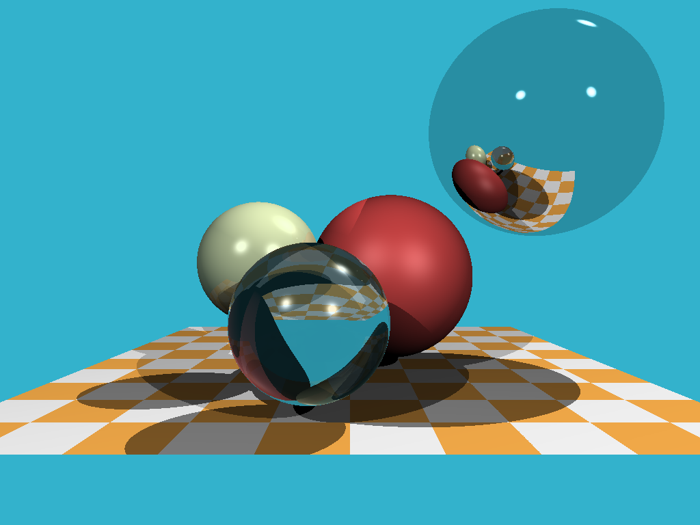
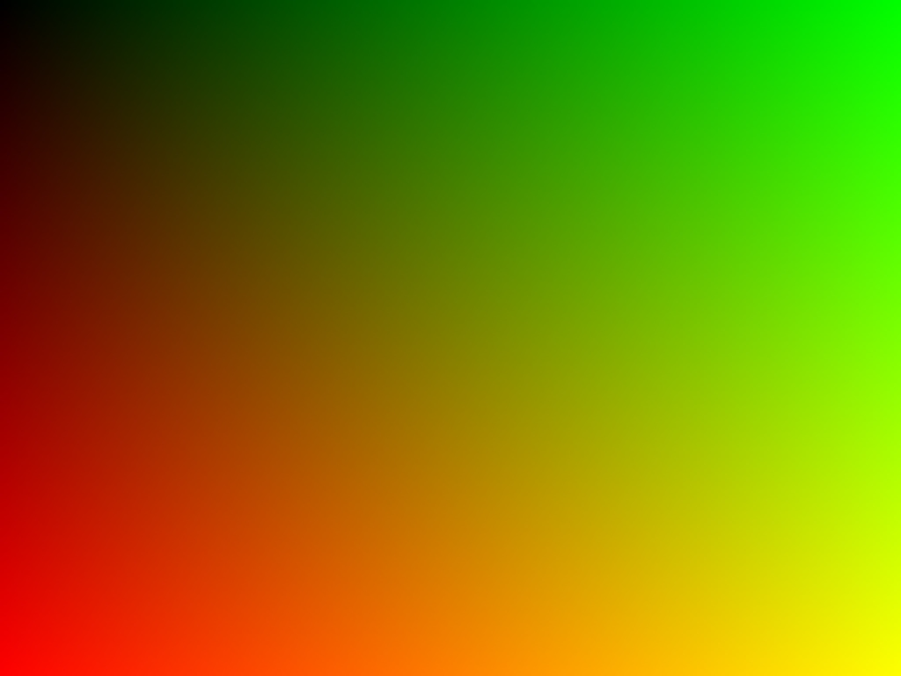

# 基础光线追踪

不同于[光栅化](https://zh.wikipedia.org/wiki/%E6%A0%85%E6%A0%BC%E5%8C%96)，光线追踪基于物理光学原理，模拟光线在场景中的传播，生成高质量图像。传统的光栅化难以实现真实世界中的阴影、全局效果，而在光线追踪中，从相机或观察者位置发射光线，并跟踪这些光线在场景中的路径，直到它们与物体相交或到达场景的边界为止。通过考虑光线与场景中物体之间的相交情况，光线追踪可以模拟出真实世界中的光照、反射、折射等光学效果。

本文将使用C++且不依赖第三方库，实现一个基本的光线追踪。以下是最终效果：



光线追踪通常包括以下步骤：

1. 发射光线：从相机或观察者位置发射光线，通常是沿着每个像素的视线方向。
2. 光线求交：跟踪光线在场景中的路径，确定光线是否与场景中的物体相交。
3. 计算光线与物体的交点：如果光线与物体相交，则计算光线与物体的交点，这个交点可能是光线与物体表面的交点。
4. 光照计算：对于交点处的光线，根据场景中的光源以及物体的表面属性（如材质、颜色等），计算光线对交点的影响，包括漫反射、镜面反射、折射等效果。
5. 递归：对于反射、折射等情况，可以递归地发射新的光线，并在场景中继续跟踪，以模拟光线的多次反射和折射。

我们将一步步完成所有步骤，在实现光线追踪之前，我们需要做一些准备工作，搭建一个场景。

* 向量操作库
* 图像合成
* 创建物体对象

### 简单的向量操作库

因为不依赖与第三方库，我们需要自己写一个简单的向量库以方便后续操作。这里直接使用Github上的[tinyraytracer](https://github.com/ssloy/tinyraytracer/wiki)项目的中`geometry.h`。简单讲解一下代码，主要内容是C++中模板的使用：

```c++
template <size_t DIM, typename T> struct vec {
    vec() { for (size_t i = DIM; i--; data_[i] = T()); }
    T& operator[](const size_t i) { assert(i < DIM); return data_[i]; }
    const T& operator[](const size_t i) const { assert(i < DIM); return data_[i]; }
private:
    T data_[DIM];
};
```

定义一个模板结构体 `vec`，它有两个模板参数，`DIM` 表示向量的维度，`T` 表示向量元素的数据类型。

```c++
typedef vec<2, float> Vec2f;
typedef vec<3, float> Vec3f;
typedef vec<3, int  > Vec3i;
typedef vec<4, float> Vec4f;
```

定义了维度为2、3、3和4的向量的类型别名。

```c++
template <typename T> struct vec<3, T> {
    vec() : x(T()), y(T()), z(T()) {}
    vec(T X, T Y, T Z) : x(X), y(Y), z(Z) {}
    T& operator[](const size_t i) { assert(i < 3); return i <= 0 ? x : (1 == i ? y : z); }
    const T& operator[](const size_t i) const { assert(i < 3); return i <= 0 ? x : (1 == i ? y : z); }
    float norm() { return std::sqrt(x * x + y * y + z * z); }
    vec<3, T>& normalize(T l = 1) { *this = (*this) * (l / norm()); return *this; }
    T x, y, z;
};
```

对于三维向量 `vec<3, T>`进行了偏特化，添加了额外的成员`z`，并提供了计算向量长度和标准化的函数，以及实现叉乘运算的函数 `cross`。

```c++
template <typename T> vec<3, T> cross(vec<3, T> v1, vec<3, T> v2) {
    return vec<3, T>(v1.y * v2.z - v1.z * v2.y, v1.z * v2.x - v1.x * v2.z, v1.x * v2.y - v1.y * v2.x);
}
```

向量叉乘函数，用于计算两个三维向量的叉积，返回一个新的向量。

剩下的就是重载。

运算符重载

- `operator*` 重载乘法运算符，使得可以对两个向量进行点乘操作。
- `operator+` 和 `operator-` 重载了加法和减法运算符，可以对两个向量进行逐元素的加法和减法操作。
- `operator-` 重载取负号运算符，可以对向量进行取反操作。
- `operator<<` 重载输出流运算符，使得可以方便地输出向量的元素值。

输出流重载

- `operator<<` 重载输出流运算符，使得可以方便地输出向量的元素值。

### 图像合成

```c++
#include "geometry.h"
#include <chrono>
#include <fstream>
#include <iostream>
#include <vector>

void render() {
    const int width = 1024;
    const int height = 768;
    std::vector<Vec3f> framebuffer(width * height);

    for (size_t j = 0; j < height; j++) {
        for (size_t i = 0; i < width; i++) {
            // 通过计算像素的 UV 坐标（归一化坐标）来生成渲染结果。UV 坐标的范围是 [0, 1]，表示屏幕上每个像素的位置。
            framebuffer[i + j * width] = Vec3f(j / float(height), i / float(width), 0);
        }
    }

    std::ofstream ofs;
    ofs.open("out.ppm",  std::ofstream::binary);
    ofs << "P6\n" << width << " " << height << "\n255\n";
    for (size_t i = 0; i < height * width; ++i) {
        for (size_t j = 0; j < 3; j++) {
            ofs << (char)(255 * std::max(0.f, std::min(1.f, framebuffer[i][j])));
        }
    }
    ofs.close();
}

int main() {
    auto start = std::chrono::high_resolution_clock::now();
    
    render();
    
    auto end = std::chrono::high_resolution_clock::now();
    std::chrono::duration< double > diff = end - start;
    std::cout << "take: " << diff.count() << " s\n";
    return 0;
}
```

 PPM格式相对简单，易于理解和实现。 P6格式是PPM的**二进制**子格式之一。与P3格式（文本PPM）相比，P6格式使用二进制数据来存储图像信息，这在一定程度上可以减少文件大小。

P6格式中的每个像素用RGB三原色来表示，每个颜色通道占据一个字节，因此每个像素需要3个字节来表示颜色信息。

通过代码不难看出，P6格式：

* 文件头：包含格式标识符、图像宽度、图像高度和最大像素值等信息
* 按照RGB顺序排列的像素数据

在主函数中，还添加了记录程序运行时间的代码。

你可以用Adobe Photoshop，[GIMP](https://www.gimp.org/)等软件打开ppm文件。若代码运行成功，你将看到如下图像：



> TEST IMAGE

## References

GitHub, ssloy, [Understandable RayTracing in 256 lines of bare C++](https://github.com/ssloy/tinyraytracer)

Github, RayTracing, [Ray Tracing in One Weekend Book Series](https://github.com/RayTracing/raytracing.github.io)
